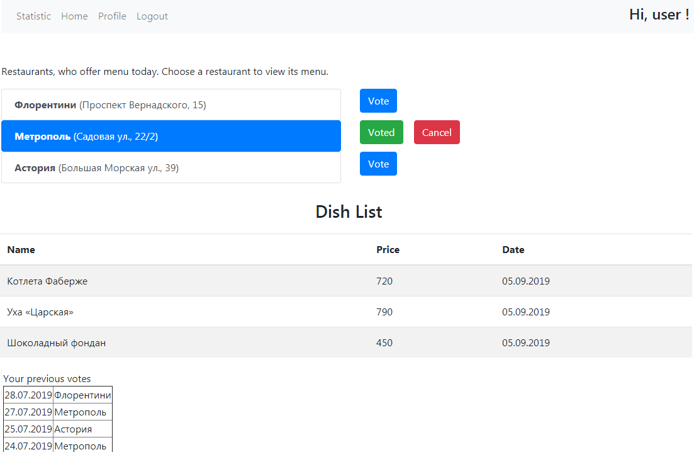
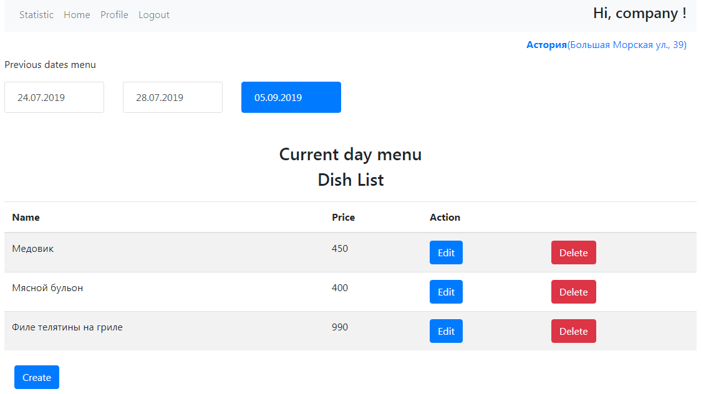
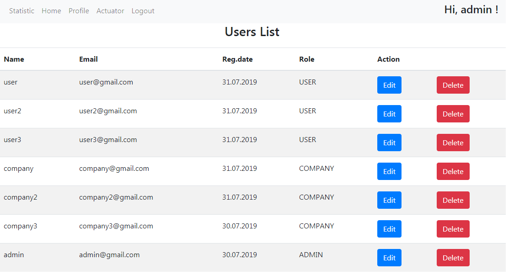
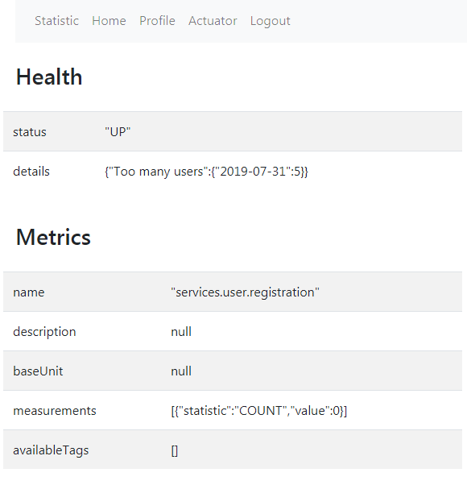

# Restaurant rating system

## Used stack:
<b>Backend:</b> Java, Spring Boot, Spring Data, Spring Security, Spring Integration, Spring Mail, Spring Actuator 
<b>Frontend:</b> ReactJS, Javascript, Bootstrap  
<b>Database:</b> PostgreSQL 
<b>Tests:</b> JUnit5, AssertJ, Mockito, H2 
<b>Docker</b> 

### Description
Restaurants offer the menu every day. Clients can look through menu and vote for a restaurant. 
There are 3 roles: user, company, admin 
##### Company can
- create a restaurant
- add/edit/delete current menu(dish, price)
- edit profile
- view statistics  
##### User can

- see current restaurants menu
- vote for a restaurant
- see his votes for previous days
- edit profile
- view statistics
- see welcome-mail, that is sent after his registration  

##### Admin can
- edit/delete users
- see Spring Actuator metrics

### Run program

In docker run command  
` docker-compose up –-build `  
Open the page in browser  
` http://your_IP_address_in_docker:3000 `    

